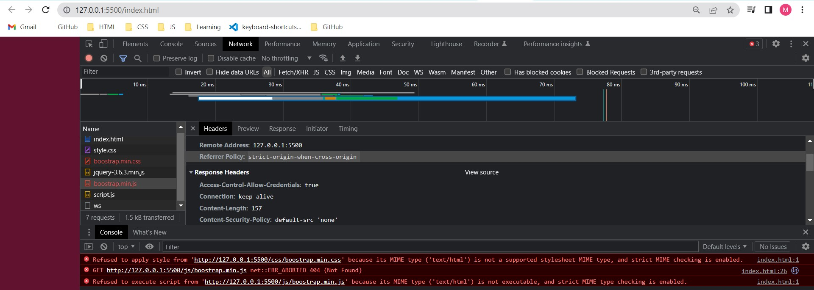
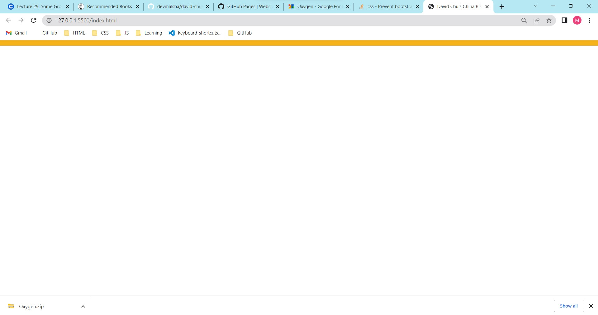

# 2023.01.30

## Error :01



## Error :02

not applying background color which set to body.


## ERROR :03

Didn't show the image on the navigation bar.

| ERROR NUMBER | ERROR                                            | SOLUTION                                                                                                                                                                                                                                                                                          |
| ------------ | ------------------------------------------------ | ------------------------------------------------------------------------------------------------------------------------------------------------------------------------------------------------------------------------------------------------------------------------------------------------- |
| 01           | Stylesheet not loaded because of MIME type       | I was typed "css/boostrap.min.css" . But it should be "css/bootstrap.min/css"for more detail : https://developerf1.com/how-to/solving-stylesheet-not-loaded-because-of-mime-type#:~:text=Refused%20to%20apply%20style%20from,this%20is%20not%20a%20node.                                          |
| 02           | not applying background color which set to body. | Solution 01: Set the link which call bootsrap.min.css before the link which call style.css file.\ Solution 02: Create a class including background-color attribute and call it inside the `<body>` tag on html file. This will override the default css rules which applied by bootstrap.min.css. |
| 03           | browser show the image file path couldn't fine.  | url should be specified relative to existing location. It means relative to html.index file location. `"/images/<iamge name>"`\ for more detail: https://stackoverflow.com/questions/5815452/how-to-use-relative-absolute-paths-in-css-urls                                                       |

# 2023.01.31

## ERROR :04

Didn't work ".pull-left" bootstrap class.

```html
<a href="index.html" class="pull-left">
  <div id="logo-img" alt="Logo image"></div>
</a>
```

| ERROR NUMBER | ERROR                                     | SOLUTION                                                                                                                                                                                                                                                               |
| ------------ | ----------------------------------------- | ---------------------------------------------------------------------------------------------------------------------------------------------------------------------------------------------------------------------------------------------------------------------- |
| 04           | Didn't work ".pull-left" bootstrap class. | In the bootstrap version 5, ".pull-left" class is replaced by ".float-start" This class suppose to be pull the html element to the left relative to parent element. For more detail: https://www.webdevsplanet.com/post/bootstrap-pull-left-and-pull-right-not-working |
|              |
